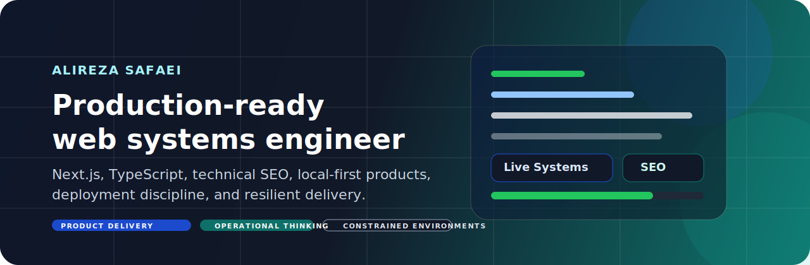
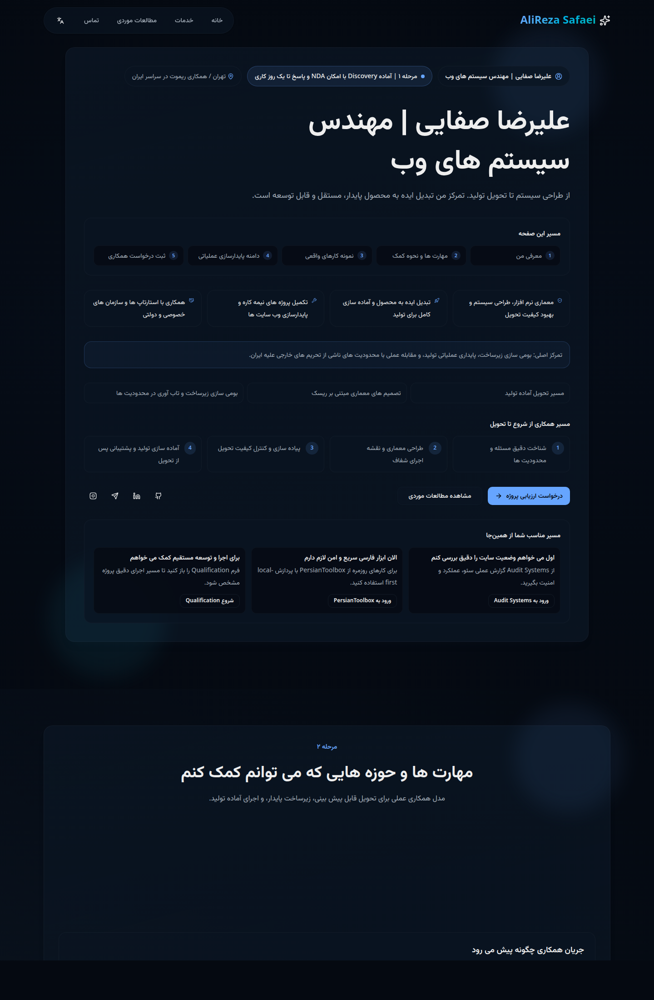
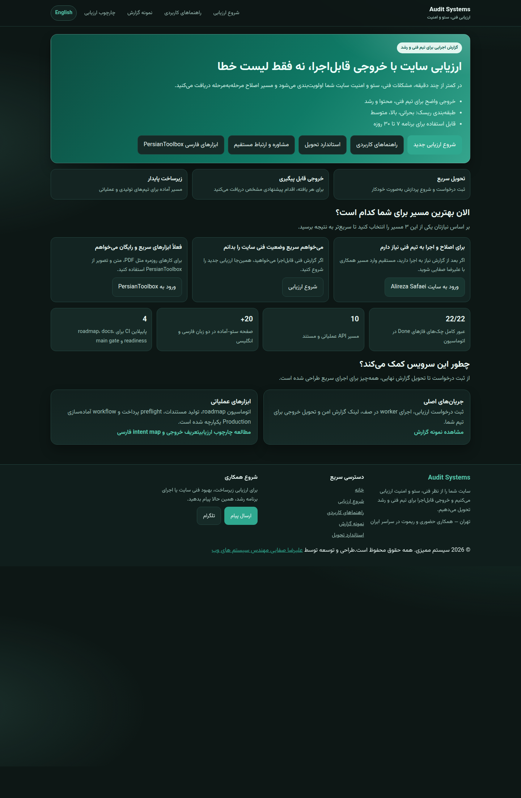
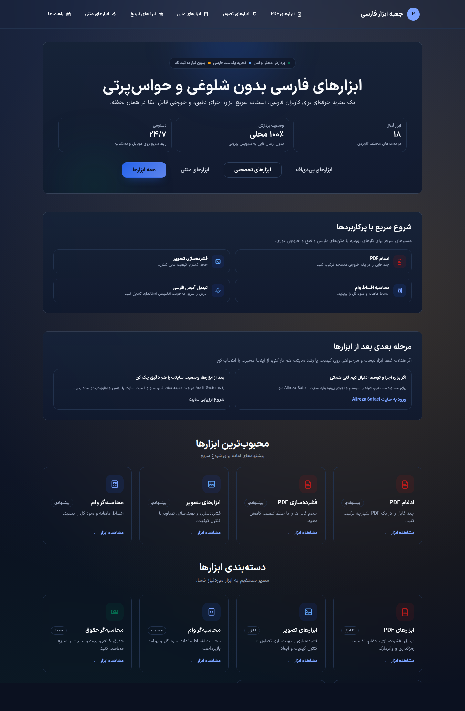
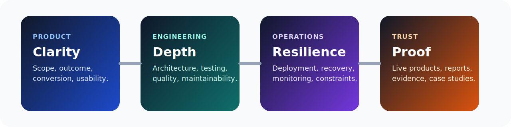

  

  
  
  

  
  
  
  

## Who I Am

I build production-ready web systems, technical SEO workflows, and local-first products for real-world constrained environments.

My work sits at the intersection of:

- product delivery that ships and stays maintainable
- technical depth that clients can trust in production
- operational thinking that reduces fragility and dependency
- practical UX that makes complex systems feel clear and usable

If someone lands here in 30 seconds, I want them to understand one thing:

> I do not just build pages. I build deployable, reliable systems that solve real business problems.

## Why This Profile Exists

This GitHub profile is designed as a public proof layer for:

- freelance clients who need confidence before the first call
- founders who want a developer who can own delivery end to end
- teams who care about engineering quality, deployment, and resilience
- anyone evaluating whether I can turn messy constraints into working software

## What I Deliver

| Area | What clients get |
| --- | --- |
| Product engineering | Next.js and TypeScript systems with clean architecture and clear delivery scope |
| Technical SEO | audit workflows, issue discovery, reporting, and action-oriented recommendations |
| Production hardening | performance work, failure-point reduction, deployment cleanup, and operational checks |
| Infrastructure | VPS, Nginx, PM2, and pragmatic release flows for stable launches |
| Local-first execution | reduced external dependency, resilient workflows, and constrained-environment thinking |

## Featured Projects

<table>
  <tr>
    <td valign="top" width="50%">
      <h3><a href="https://github.com/alirezasafaei-dev/alirezasafaeisystems">alirezasafaeisystems</a></h3>
      
Personal portfolio and lead-generation system built to convert trust into project inquiries.

      
<strong>Role:</strong> brand, credibility, conversion

      
<strong>Stack:</strong> Next.js, TypeScript, Prisma, deployment automation

      
<strong>Live:</strong> <a href="https://alirezasafaeisystems.ir">alirezasafaeisystems.ir</a>

    </td>
    <td valign="top" width="50%">
      <h3><a href="https://github.com/alirezasafaei-dev/auditsystems">auditsystems</a></h3>
      
Technical SEO and website audit platform focused on actionable diagnosis and service-led conversion.

      
<strong>Role:</strong> entry offer, technical proof, lead magnet

      
<strong>Stack:</strong> Next.js, TypeScript, Prisma, background workflows

      
<strong>Live:</strong> <a href="https://audit.alirezasafaeisystems.ir">audit.alirezasafaeisystems.ir</a>

    </td>
  </tr>
  <tr>
    <td valign="top" width="50%">
      <h3><a href="https://github.com/alirezasafaei-dev/persiantoolbox">persiantoolbox</a></h3>
      
Utility product for fast, accurate, Persian-first daily tasks with strong execution and low friction.

      
<strong>Role:</strong> public utility, product proof, traffic asset

      
<strong>Stack:</strong> Next.js, TypeScript, testing and release automation

      
<strong>Live:</strong> <a href="https://persiantoolbox.ir">persiantoolbox.ir</a>

    </td>
    <td valign="top" width="50%">
      <h3><a href="https://github.com/alirezasafaei-dev/creatormembership">creatormembership</a></h3>
      
Membership platform for creators selling gated digital access, positioned as a near-term launchable MVP.

      
<strong>Role:</strong> monetization product, systems thinking, workflow ownership

      
<strong>Stack:</strong> monorepo, API and web apps, automation scripts

      
<strong>Status:</strong> pre-launch and narrowing toward sellable scope

    </td>
  </tr>
  <tr>
    <td valign="top" width="50%">
      <h3><a href="https://github.com/alirezasafaei-dev/devatlas">devatlas</a></h3>
      
Production-grade monorepo for a developer knowledge and tooling platform with strong architectural foundations.

      
<strong>Role:</strong> engineering depth, architecture showcase

      
<strong>Stack:</strong> pnpm workspace, Turbo, Next.js, NestJS, shared packages

      
<strong>Status:</strong> active development

    </td>
    <td valign="top" width="50%">
      <h3><a href="https://github.com/alirezasafaei-dev/microcatalog">microcatalog</a></h3>
      
Monetizable MVP concept for sellers who need a practical catalog presence under constrained online conditions.

      
<strong>Role:</strong> commercial opportunity, lightweight product path

      
<strong>Stack:</strong> modular monolith, pnpm workspace, frontend and backend split

      
<strong>Status:</strong> roadmap and base architecture ready

    </td>
  </tr>
</table>

## Live Product Screenshots

<table>
  <tr>
    <td valign="top" width="33%">
      
      
<strong>alirezasafaeisystems</strong> Portfolio and conversion system in production.

    </td>
    <td valign="top" width="33%">
      
      
<strong>auditsystems</strong> Technical SEO and website audit platform running live.

    </td>
    <td valign="top" width="33%">
      
      
<strong>persiantoolbox</strong> Persian-first utility product with public production surface.

    </td>
  </tr>
</table>

For `creatormembership`, `devatlas`, and `microcatalog`, I keep the portfolio positioning public but will only add screenshot proof after the corresponding live deployment is public and stable.

## Systems Mindset

  

I care about the full delivery chain, not just feature output:

- architecture that keeps velocity high after launch
- UX clarity that lowers user friction and increases trust
- deployment discipline that keeps releases boring and recoverable
- evidence and reporting that make quality visible
- infrastructure choices that respect local constraints

## Why Clients Hire Me

- I think like an engineer and a product owner at the same time
- I optimize for real delivery, not demo-only code
- I can work from UI down to deployment and operational safety
- I understand constrained environments and build around them pragmatically
- I turn live products into reusable proof, not one-off implementations

## Services

### Core services

- technical SEO audits with an actionable remediation path
- Next.js product builds and architecture cleanup
- website performance and production hardening
- VPS, Nginx, PM2, and deployment stabilization
- local-first product strategy for fragile or restricted ecosystems

### Best-fit projects

- service websites that must convert better
- product dashboards and internal tools
- audit and reporting systems
- platforms that need a stable production launch
- products that cannot depend too heavily on third-party infrastructure

## Current Direction

- strengthen public proof and attract higher-quality freelance work
- refine live systems already running in production
- move one product to a realistic MVP instead of scattering effort
- turn engineering depth into a clearer business-facing portfolio

## Quick Links

- `Portfolio`: [alirezasafaeisystems.ir](https://alirezasafaeisystems.ir)
- `Audit platform`: [audit.alirezasafaeisystems.ir](https://audit.alirezasafaeisystems.ir)
- `Product`: [persiantoolbox.ir](https://persiantoolbox.ir)
- `GitHub`: [github.com/alirezasafaei-dev](https://github.com/alirezasafaei-dev)

## Contact

If you need a developer who can take ownership from architecture to deployment and ship a production-ready system, I am open to project work and serious collaborations.
